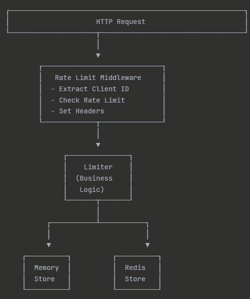

# Rate Limiter Service

A thread-safe rate limiting service built with Go that implements a fixed window rate limiting algorithm. Implementation uses a per-client fixed window with lazy initialization: the window starts on the client’s first hit (TTL set on first increment), not on wall-clock minute boundaries. Supports both in-memory and distributed (Redis) storage backends with comprehensive testing and clean architecture.

## Table of Contents

- [Features](#features)
- [Architecture Overview](#architecture-overview)
- [Design Decisions](#design-decisions)
- [Rate Limiting Algorithm](#rate-limiting-algorithm)
- [Getting Started](#getting-started)
- [API Usage](#api-usage)
- [Testing](#testing)
- [Assumptions & Limitations](#assumptions--limitations)

---

## Features

✅ **Fixed Window Rate Limiting** - Efficient request counting per time window  
✅ **Multi-Client Support** - Individual rate limits per client  
✅ **Thread-Safe** - Handles concurrent requests safely  
✅ **Dual Storage Backend** - In-Memory (development) and Redis (production)  
✅ **Standard HTTP Headers** - `X-RateLimit-*` headers for client visibility  
✅ **Clean Architecture** - Separation of concerns with testable components  
✅ **Testing** – Includes comprehensive unit tests ensuring core functionality and reliability  
✅ **Docker Support** - Easy deployment with Docker Compose  
✅ **Graceful Shutdown** - Proper cleanup and connection handling  
✅ **Structured Logging** - JSON logs for easy monitoring and debugging

---

## Architecture Overview

### Project Structure

```
rate-limiter/
├── config/
│   └── config.go              # Rate limit configurations
├── internal/
│   ├── handler/
│   │   ├── handler.go        # HTTP request handlers
│   │   └── handler_test.go
│   ├── middleware/
│   │   ├── ratelimit.go       # Rate limiting middleware
│   │   └── ratelimit_test.go
│   ├── limiter/
│   │   ├── limiter.go         # Core rate limiting logic
│   │   └── limiter_test.go
│   └── storage/
│       ├── memory/
│       │      └── memory.go      # In-memory storage implementation  
│       └── redis/
│              └── redis.go       # Redis storage implementation
├── .env
├── main.go                   
├── docker-compose.yaml         
├── Dockerfile                                
├── architecture.png
└── Readme.md
```

### Architecture Diagram



---

## Design Decisions

### 1. **Layered Architecture**

**Decision:** Separate concerns into distinct layers (handlers, middleware, business logic, storage).

**Rationale:**
- **Testability** - Each layer can be tested independently with mocks
- **Maintainability** - Changes in one layer don't affect others
- **Reusability** - Middleware and limiter can be used in different contexts
- **Single Responsibility** - Each component has one clear purpose

### 2. **Interface-Based Storage**

**Decision:** Define a `Store` interface for storage operations.

```go
type Store interface {
    Increment(key string, ttl time.Duration) (int64, time.Time, error)
    Get(key string) (int64, time.Time, error)
}
```

**Rationale:**
- **Flexibility** - Easy to swap between memory and Redis without changing business logic
- **Testing** - Can create mock stores for unit tests
- **Extensibility** - Can add new storage backends (Memcached, DynamoDB, etc.) without modifying limiter
- **Dependency Inversion** - High-level limiter doesn't depend on low-level storage details

### 3. **Middleware Pattern**

**Decision:** Implement rate limiting as HTTP middleware.

**Rationale:**
- **Separation of Concerns** - Rate limiting logic separated from business handlers
- **Composability** - Can be applied to any endpoint or route group
- **Reusability** - Same middleware works for all endpoints
- **Standard Pattern** - Familiar to Go developers

### 4. **Configuration via Code**

**Decision:** Define client configurations in `config/config.go` rather than external files.

**Rationale:**
- **Simplicity** - No file parsing or validation errors
- **Type Safety** - Compile-time type checking
- **Version Control** - Configuration changes tracked in git
- **Suitable for Demo** - Easy to understand and modify

**Note:** In production, consider using environment variables or configuration files for dynamic updates.

### 5. **Standard Rate Limit Headers**

**Decision:** Use standard `X-RateLimit-*` headers following RFC 6585.

```
X-RateLimit-Limit: 100
X-RateLimit-Remaining: 99
X-RateLimit-Reset: 1234567890
```

**Rationale:**
- **Industry Standard** - Used by GitHub, Twitter, Stripe, etc.
- **Client Visibility** - Clients can see their limit status
- **Integration** - Works with standard rate limit libraries
- **Debugging** - Easy to troubleshoot rate limit issues

### 6. **Atomic Operations**

**Decision:** Use `sync.Mutex` and `atomic` operations for memory store, Redis pipelines for Redis store.

**Rationale:**
- **Thread Safety** - Prevents race conditions under concurrent load
- **Performance** - Atomic operations are faster than mutex locks for counters
- **Correctness** - Ensures accurate rate limit counting
- **Redis Efficiency** - Pipelines reduce round-trip time

---

## Rate Limiting Algorithm

### Fixed Window Algorithm

This implementation uses the **Fixed Window** algorithm, which divides time into fixed-size windows and counts requests per window.

#### How It Works

```
Time:     0s              60s             120s            180s
          |---------------|---------------|---------------|
Window:   [   Window 1   ][   Window 2   ][   Window 3   ]
Requests: 1  2  3  4  5      1  2  3         1  2  3  4
Counter:  1  2  3  4  5      1  2  3         1  2  3  4
```

**Algorithm Steps:**

1. **Request arrives** → Extract client ID
2. **Get or create counter** → `rate:client-id` key
3. **Increment counter** → Atomic increment operation
4. **Check limit** → `counter <= limit`
5. **Set TTL** (if new key) → Window duration
6. **Return decision** → Allow/Deny + Remaining + Reset time

#### Example Flow

```go
// Client: "client-1" with limit 5/minute

Request 1 → counter=1 → 1 <= 5 ✓ Allow (4 remaining)
Request 2 → counter=2 → 2 <= 5 ✓ Allow (3 remaining)
Request 3 → counter=3 → 3 <= 5 ✓ Allow (2 remaining)
Request 4 → counter=4 → 4 <= 5 ✓ Allow (1 remaining)
Request 5 → counter=5 → 5 <= 5 ✓ Allow (0 remaining)
Request 6 → counter=6 → 6 > 5  ✗ Deny (0 remaining) → 429

[After 60 seconds]
Request 7 → counter=1 → 1 <= 5 ✓ Allow (4 remaining) → New window
```


## Getting Started

### Prerequisites

- **Go 1.21+** - [Install Go](https://golang.org/doc/install)
- **Docker & Docker Compose** (optional) - [Install Docker](https://docs.docker.com/get-docker/)
- **Redis 7+** (optional, for distributed mode) - [Install Redis](https://redis.io/download)

### Installation

#### Option 1: Docker Compose (Recommended)

```bash
# Clone repository
git clone https://github.com/Dzaakk/rate-limiter.git
cd rate-limiter

# Start services (Redis + App)
docker-compose up --build

# App runs on http://localhost:8080
```

#### Option 2: Local Development (In-Memory)

```bash
# Clone and install dependencies
git clone https://github.com/Dzaakk/rate-limiter.git
cd rate-limiter
go mod download

# Run with in-memory storage (default)
go run main.go

# Or build and run binary
go build -o rate-limiter
./rate-limiter
```

#### Option 3: Local Development (Redis)

```bash
# Terminal 1: Start Redis
docker run -d -p 6379:6379 redis:7-alpine

# Terminal 2: Run app with Redis
STORAGE_TYPE=redis REDIS_ADDR=localhost:6379 go run main.go
```

### Configuration

Edit `config/config.go` to customize rate limits:

```go
var Clients = map[string]ClientConfig{
    "client-1": {Limit: 5, Window: 60 * time.Second},   // 5 req/min
    "client-2": {Limit: 2, Window: 60 * time.Second},   // 2 req/min
    "premium": {Limit: 1000, Window: time.Minute},      // 1000 req/min
}

var DefaultConfig = ClientConfig{
    Limit:  100,              // Default: 100 requests
    Window: time.Minute,      // Per minute
}
```

### Environment Variables

| Variable | Description | Default | Example |
|----------|-------------|---------|---------|
| `STORAGE_TYPE` | Storage backend | `memory` | `redis` |
| `REDIS_ADDR` | Redis server address | `localhost:6379` | `redis:6379` |

---

## API Usage

### Endpoints

#### 1. `GET /api/hello` (Rate Limited)

Test endpoint with rate limiting enabled.

**Request:**
```bash
curl -H "X-Client-ID: client-1" http://localhost:8080/api/hello
```

**Response Headers:**
```
X-RateLimit-Limit: 5
X-RateLimit-Remaining: 4
X-RateLimit-Reset: 1729681860
```

**Success Response (200 OK):**
```json
{
  "message": "Hello! Your request was successful.",
  "client_id": "client-1",
  "timestamp": "2025-10-23T10:30:00Z"
}
```

**Rate Limited Response (429 Too Many Requests):**
```json
{
  "error": "Rate limit exceeded",
  "remaining": 0,
  "reset_at": 1729681860
}
```

#### 2. `GET /api/status` (No Rate Limit)

Health check endpoint without rate limiting.

**Request:**
```bash
curl http://localhost:8080/api/status
```

**Response (200 OK):**
```json
{
  "status": "ok",
  "time": "2025-10-23T10:30:00Z"
}
```

### Example Usage

#### Test Different Clients

```bash
# Client 1 (limit: 5/min)
for i in {1..6}; do
  echo "Request $i:"
  curl -i -H "X-Client-ID: client-1" http://localhost:8080/api/hello
  echo ""
done

# Client 2 (limit: 2/min)
for i in {1..3}; do
  echo "Request $i:"
  curl -i -H "X-Client-ID: client-2" http://localhost:8080/api/hello
  echo ""
done

# Default client (limit: 100/min)
curl -i http://localhost:8080/api/hello
```

#### Monitor Rate Limit Headers

```bash
# Use -i flag to see headers
curl -i -H "X-Client-ID: client-1" http://localhost:8080/api/hello

# Or use -v for verbose output
curl -v -H "X-Client-ID: client-1" http://localhost:8080/api/hello
```

#### Concurrent Requests Test

```bash
# use hey
go install github.com/rakyll/hey@latest

hey -n 100 -c 10 -H "X-Client-ID: test" http://localhost:8080/api/hello
```

---

## Testing

```bash
# Generate coverage report
go test ./... -coverprofile=coverage.out
go tool cover -html=coverage.out -o coverage.html
```

---

## Assumptions & Limitations

### Assumptions

1. **Client Identification**
   - Clients are identified by `X-Client-ID` header
   - Clients without header use "default" config
   - Client IDs are trusted (no validation/authentication)

2. **Time Synchronization**
   - Server clock is accurate and synchronized (NTP)
   - Redis server (if used) has synchronized time
   - Important for distributed deployments

3. **Configuration**
   - Rate limits are known at compile time
   - No dynamic configuration updates
   - Requires restart to change limits

4. **Storage**
   - In-memory: Single instance only (not distributed)
   - No persistent storage for in-memory mode

5. **Traffic Patterns**
   - Normal HTTP request/response patterns
   - Request processing time < window duration

### Limitations

#### 1. **Fixed Window Edge Case**

**Limitation:** Burst traffic at window boundaries can exceed intended rate.

**Example:**
```
Limit: 5 requests/minute
Window 1 (0-60s): 5 requests at t=59s ✓
Window 2 (60-120s): 5 requests at t=60s ✓
→ 10 requests in 2 seconds (200% over rate!)
```

**Impact:** Moderate - Allows temporary bursts but averages out over time.

**Mitigation:**
- Use shorter windows (trade-off: more memory)
- Implement sliding window (trade-off: complexity)

#### 2. **Memory Storage Limitations**

**Limitation:** In-memory storage is not distributed.

**Implications:**
- Data lost on restart
- Each instance has separate limits

**When to use:**
- Development/testing
- Single-instance deployments
- Low-traffic applications

**Solution:** Use Redis for production/distributed deployments.

#### 3. **No Persistent Configuration**

**Limitation:** Configuration changes require code changes and redeployment.

**Impact:** Low flexibility for operational changes.

**Workarounds:**
- Use environment variables for common settings
- Implement configuration API (future enhancement)
- Use feature flags service

#### 4. **Client ID Trust**

**Limitation:** No validation or authentication of client IDs.

**Security Risk:** Clients can spoof identifiers.

**Mitigations:**
- Add API key validation
- Use JWT tokens with embedded client ID
- Implement IP-based rate limiting
- Add request signing

---

## Troubleshooting

### Common Issues

**1. Rate limit not working**
```bash
# Check if middleware is applied
curl -i http://localhost:8080/api/hello
# Should see X-RateLimit-* headers

# Verify client ID
curl -H "X-Client-ID: client-1" http://localhost:8080/api/hello
```

**2. Redis connection failed**
```bash
# Check Redis is running
docker ps | grep redis

# Test Redis connection
redis-cli ping
# Should return: PONG

# Check Redis logs
docker logs redis
```

**3. Tests failing**
```bash
# Clean test cache
go clean -testcache

# Run specific test
go test ./internal/middleware -v -run TestRateLimitMiddleware_Handler_Success

# Check for race conditions
go test ./... -race
```

**4. High memory usage**
```bash
# Check number of keys in memory
# In-memory: No direct way (debug logs)

# Redis: Count keys
redis-cli DBSIZE

# Monitor memory
docker stats redis
```

---
